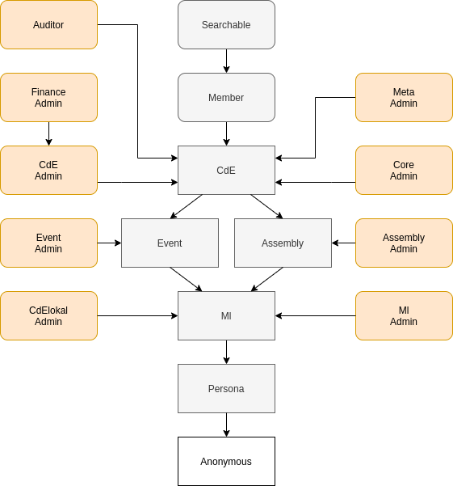

Role Model
==========

Personas
--------

Each persona can have the following privileges:

* being a persona (in contrast to anonymous access)
* access to a specific realm (cde, event, ml, assembly)
* admin privileges in a realm (core, cde, event, ml, assembly)
* meta admin
* finance admin
* cdelokal admin
* membership
* searchability

Note that these roles can not be awarded independently. First, every persona
has in fact ml access currently, and each admin role requires access
privileges in the corresponding realm. Here, core, cde and finance admin
roles require cde realm access, with finance admins additionally requiring
cde adminship. These rules regarding admin privileges are in fact enforced
redundantly by database constraints and the ``extract_roles`` function.

Furthermore, there is a realm inheritance in place, with higher realms
implying the access to lower realms. In practice, cde access implies
event and assembly access, while they in turn imply ml access.

This leads to the role inheritance graph shown below. Here, privileges
which can be lost are shown in round boxes, while privileges in cornered
boxes can only be gained. Therefore, former members are those with cde realm
without membership privileges.

    This graphic was created using `Draw.io <https://draw.io>`_.
    To edit it, upload the Roles.png file there.

These privileges control what actions the user may call and are determined
by the core.personas table. These are enforced throughout the python code
via the ``@access`` decorator.

Additionally there may be finer grained privileges which are encoded in
various tables which are checked locally in the relevant pieces of code. The
following additional privileges are

* orga of an event
* moderator of a mailinglist
* presider of an assembly

Due to complex inter-realm dependencies, mailinglist privileges have some caveats
which are explained further at :doc:`Realm_Mailinglist_Privileges`.

.. todo:: Weiterführende Referenz auf Realm_Core_Personas

Droids
------

Each droid can have the following privileges:

* being a droid (in contrast to anonymous access)
* per droid identity privilege
* infrastructure toggle (making them exempt from lockdown)

More to droids at :doc:`API_Droids`.

Database
--------

In the database everything is mapped onto four tiers

* anonymous,
* persona,
* member,
* admin.

More to database at :doc:`Design_Database`.
