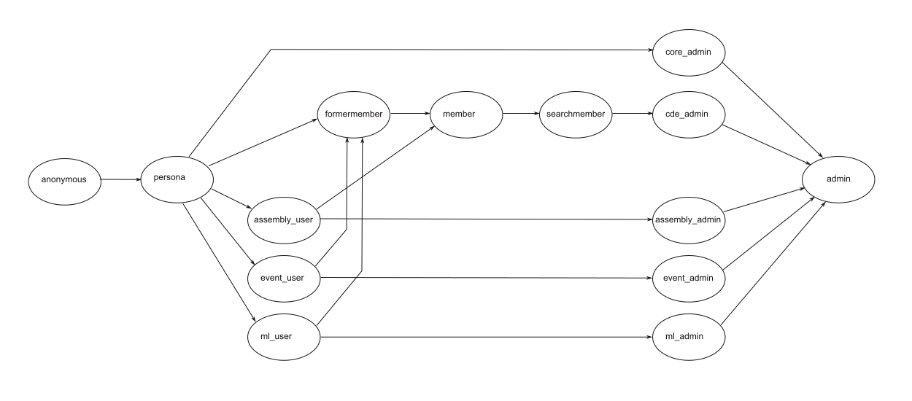

Architecture
============

Design
------

This WSGI-application has three main parts: frontend (python), backend
(python) and database (SQL). The communication between frontend and backend
is mediated by :py:mod:`Pyro4` and between backend and database by
:py:mod:`psycopg2`. Everything is split into several realms (see below) to
separate orthogonal problems from each other like member register from event
organization. In the python code this is achieved by different classes for
each realm and in the SQL code we have different schemas for each realm.

The python code is state-less and thus easily parallelizable. This is
exploited in the frontend (where Apache does multithreading) and the backend
(where Pyro does multithreading). All state is kept in the database. For
accountability we keep a record of all sessions and only allow one active
session per user or per IP.

The basic account is referred to as persona. Each persona has an associated
realm to which it belongs. Thus it is possible to uniquely identify the
users of all realms by there persona id.

Realms
------

The realms group functionality into semantic units. There are four major
realms which have frontend, backend and their own user accounts.

* cde -- CdE specific section
* event -- events like academies
* ml -- mailing lists
* assembly -- annual CdE assemblies

Then there are some more specialised realms.

* core -- basic infrastructure, servicing all realms, no user accounts
* session -- backend only, used for resolving session keys stored in cookies

Currently undecided fate (will maybe be integrated into other realms):

* files -- file storage
* i25p -- Initiative 25+

.. _privileges:

Privileges
----------

The available privilege levels (a.k.a. roles) are as in the following graph
(where an arrow indicates a strictly higher privilege level).

Roughly speaking we have the following roles available in the python code

* anonymous,
* persona,
* user of a specific realm,
* former member,
* member,
* searchable member,
* admin of a specific realm,
* global admin.

In the database they are mapped onto four tiers

* anonymous,
* persona,
* member,
* admin.

These roles controle what actions the user may call and are determined by
the core.personas table (by the ``status`` and the ``db_privileges``
entries). These are enforced throughout the python code via the ``@access``
decorator.

Additionally there may be finer grained privileges which are encoded in
various tables which are checked locally in the relevant pieces of code. The
following additional privileges are there.

* orga of an event
* moderator of a mailing list
