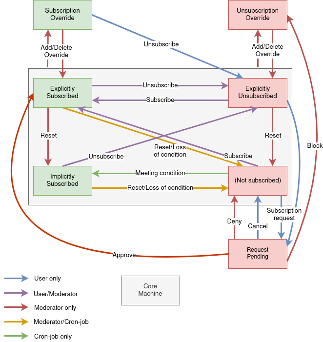

Mailinglist Management
======================

We use a fairly complex state schema to manage mailinglist subscription states
internally. These states are only incompletely displayed to moderators and
admins using the management page, however a raw CSV file can be downloaded
showing the actual internal states.

    This graphic was created using `Draw.io <https://draw.io>`_.
    To edit it, upload the SubscriptionState.png file there.

We are using a total of seven distinct states, which allow a consistent and
useful subscription management, even if the mailinglist configuration changes.

Every transition between these states is modeled by a corresponding ``SubscriptionAction``, which
are shown as arrows in the graph. While most subscription actions act on multiple
states, there is always a unique target state associated with each action.
Analogously, every subscription action has a specific log code, which may however
be used by multiple, similar actions.

There is a strict separation between transitions done by users and by moderators;
they are using different frontend endpoints which are accessed by different
interfaces. This way, even moderators and admins can request subscriptions to
lists they can manage, while they can only subscribe directly using the
management interface. Analogous, they can only subscribe to invitation only
lists using the management interface.

To maintain the correct states, we use a cron job running every 15 minutes to
take care of automatic state transitions on all active mailinglists.
This actually does not make use of the ``SubscriptionAction`` enum, but makes use of
its own internal state transitioning logic. In contrast to user induced changes,
we only log unsubscriptions done by the cronjob, while new subscriptions are
not logged. This is done to simplify reversing unwanted unsubscriptions manually.

In the CdEDBv2, we distinct between subscribing (shown in green in the graph)
and other states (shown in red, respectively), where users
listed in subscribing states receive list emails via our :doc:`Realm_Mailinglist_Software`.
For subscribers, there is no visible distinction between the different
subscribing states. Subscribing states are:

Explicitly Subscribed
    Users, which have been actively subscribed to a mailinglist, either by
    themselves or by a moderator, are saved as explicitly subscribed.
    If these users have no more means to access a list, for example because they
    lost membership, or because they no longer attend an event, they are removed
    from the mailinglist.
    Mailinglists without special membership implicators only have explicit
    subscribers.

Subscription Override
    Subscription Overrides are a special kind of explicit subscriptions, which are
    kept even if the user should not be able to access a list anymore. However,
    except for mandatory lists, they do not prevent a user from unsubscribing
    themselves.
    The list of Subscribe Overrides can be accessed by moderators via the
    management interface.

Implicitly Subscribed
    Users, which are subscribed to a mailinglist, because they meet some condition,
    are listed as implicit subscribers. Typical examples are mailinglists having all
    members or all attendees of an event or assembly as implicit subscribers. If users
    lose the automatic implicator that subscribes them to the list, they are
    removed even if they would still be able to access it.

    Implicit subscribers are stored in the database explicitly. This ensures the
    subscriber list displayed is always identical to the list of users emails
    are actually sent to.

Other states are:

None (Implicitly Unsubscribed)
    This is the standard state for users having no relationship to a list
    whatsoever, because they never were listed on it or lost access to it.
    This state is the only one not explicitly saved in the database.

.. _Explicitly_Unsubscribed:

Explicitly Unsubscribed
    Users, which have specified they do not want to receive emails from a
    specific mailinglist anymore. This decision is permanent, until manually
    reverted by them or a moderator. Even if they lose access to a list, this
    information is kept. Thus, if they regain access later on, these users
    will not be receiving emails from it.
    However, if they are explicitly subscribed again, they do not receive
    special treatment.

    Due to this fact, users tend to get "stuck" in this case, since it is not
    cleaned up by the cronjob. For example, every user who has been manually
    removed from a mailinglist by a moderator, will stay here forever without
    further intervention. While the state transitions are designed with this
    in mind, making no difference between manual actions on explicitly and
    implicitly unsubscribed users, it is still possible for moderators to
    cleanup explicit unsubscriptions to implicit subscriptions.

    To not obstruct the design of the state schema, this should only be used
    to cleanup test cases or to prepare for the use of tools which might be
    obstructed by explicit unsubscriptions, for example the account merge tool.

Unsubscription Override
    Unsubscription Overrides are a special kind of explicit unsubscriptions, which
    can not be removed by the affected user. Except for mandatory lists, they
    can be used to block a specific user from any kind of subscription or
    subscription request and are displayed to a user when accessing the
    mailinglist information page.
    The list of Unsubscription Overrides can be accessed by moderator via the
    management interface.

Request Pending
    This is a special case only existing for mailinglists with moderated opt-in
    subscription policy for a group of users.
    Users with pending subscription requests are displayed on a
    specific list to moderators, so they can decide if they want to approve or
    deny their request. It is also possible to block further requests by this
    user.

The only case, where a list configuration change explicitly changes subscription
states (Explicit and implicit subscriptions can still be removed if the
configuration change makes them lose their means of access!) is a conversion to
a mandatory list. In this case, all explicit unsubscriptions, including
Unsubscription Overrides, are deleted.

Email adresses for specific mailinglists are saved separately from the
subscription state to make them persistent over all states.
